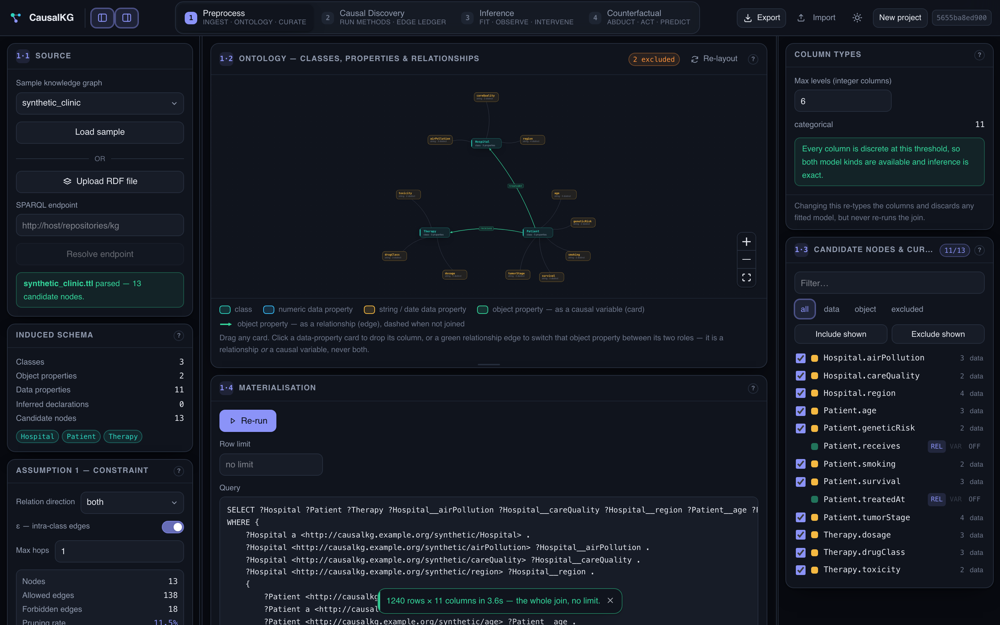
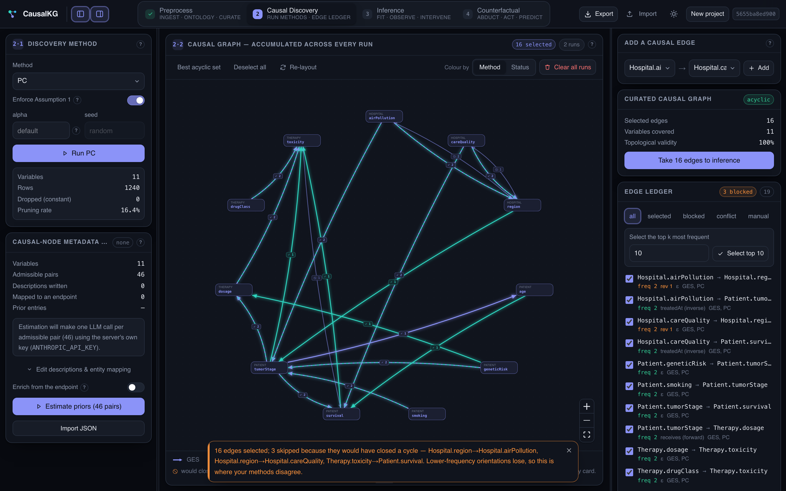
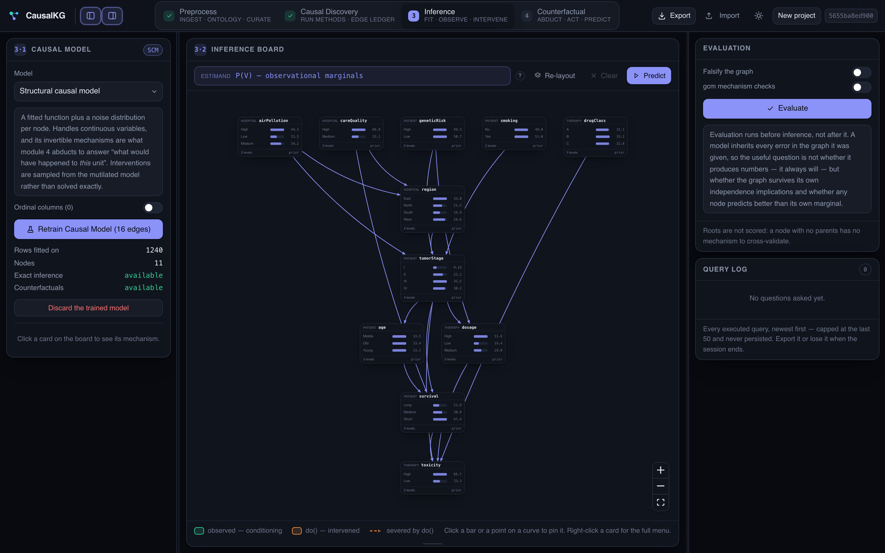
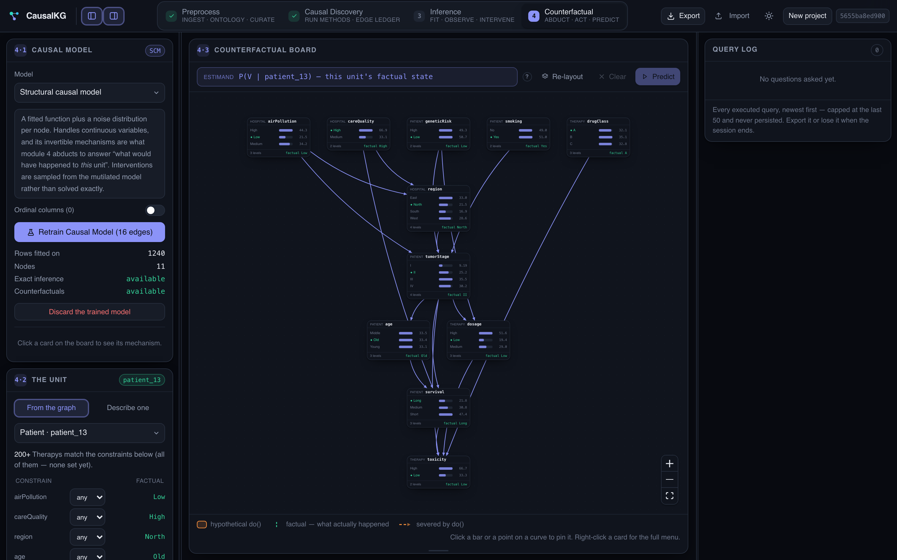

# CausalKG

**Causal discovery, causal modelling and counterfactual reasoning over the *properties* of a
knowledge graph.**

Give CausalKG a knowledge graph — a Turtle/N-Triples file or a SPARQL endpoint — and it will induce
the schema, turn every property into a candidate causal variable, prune the search space with an
ontological assumption, run causal discovery, fit a causal model, and answer conditional,
interventional and entity-level counterfactual questions. Everything it learns can be exported back
as RDF.

It ships as three things you can use independently:

| Component | What it is | Where to start |
|---|---|---|
| **`causalkg` + `algs` + `runners`** | A Python package: KG → schema → flat join → discovery → SCM/CBN → queries → RDF | [Using the Python package](#using-the-python-package) |
| **CausalKG Studio** | A four-module web application over the same engine, one FastAPI process, one port | [Using the web service](#using-the-web-service) |
| **CLI runners** | `run_kg_discovery.py` (discovery) and `run_causal_model.py` (fit / query) | [Command line](#command-line) |

---

## Table of contents

- [The idea](#the-idea)
- [Installation](#installation)
- [Using the web service](#using-the-web-service)
- [Using the Python package](#using-the-python-package)
- [Command line](#command-line)
- [RDF output and the `ckg:` vocabulary](#rdf-output-and-the-ckg-vocabulary)
- [Repository layout](#repository-layout)
- [Testing](#testing)
- [Known limitations](#known-limitations)
- [License](#license)

---

## The idea

A knowledge graph is a directed edge-labelled graph *KG = (V, L, E)*. Its **classes** *C ⊆ V*
partition the entities; its **object properties** **P**<sub>obj</sub> relate entities across classes
and its **data properties** **P**<sub>dat</sub> attach literals to them. Every property *p* has a
domain class *D<sub>p</sub>* and a range *R<sub>p</sub>*.

CausalKG does not do causal discovery over entities. It does causal discovery over **property
nodes**:

> **Property node.** A causal variable is the triple **(D<sub>p</sub>, p, R<sub>p</sub>)** — the
> property, the class it is attached to, and its range. `Patient.smoking` and `Hospital.region` are
> two different variables even if they were the same predicate, because they belong to different
> classes.

Which pairs of property nodes are even *allowed* to be causally related is not left to the data:

> **Assumption 1 (Topological Causal Assumption).** A causal relationship can exist between
> properties *p<sub>i</sub>* and *p<sub>j</sub>* **iff** either
> **(1) intra-class** — `domain(p_i) = domain(p_j)`, or
> **(2) inter-class** — there is an explicit object property *R* connecting `domain(p_i)` to
> `domain(p_j)`.

The result is the **Ontological Causal Graph (OCG)** **G = (N, E<sub>N</sub>)**: nodes are property
nodes, and each edge carries a *relation label* drawn from **P**\* = **P**<sub>obj</sub> ∪ {ε}, where
ε is the identity relation standing for an intra-entity transition. An edge
*(v<sub>1</sub>, r, v<sub>2</sub>)* is topologically valid iff `r = ε` implies
*D<sub>p1</sub> = D<sub>p2</sub>*, and `r ∈ P_obj` implies *r* actually connects *D<sub>p1</sub>* to
*D<sub>p2</sub>*.

**Assumption 1 is a hard constraint, not a soft prior.** It is compiled into an *n × n* boolean
feasibility matrix and pushed *inside* each discovery algorithm — as expert knowledge for PC/GES, as
L-BFGS-B bounds for NOTEARS, as a prior matrix for LiNGAM — so forbidden edges are never scored, not
scored and then deleted.

### Materialisation: a flat join, no root class

To get a table out of the graph, CausalKG builds one **SPARQL basic graph pattern per connected
component** of the class-level schema graph: one variable per class, one row per solution binding.
1:N relations naturally expand into several rows. No class is privileged as a "root".

Every column keeps a **double provenance** — the causal node *(D<sub>p</sub>, p, R<sub>p</sub>)* it
realises **and** the BGP variable holding the entity that owns it. That is what lets an inferred
value be attributed back to the right entity, and what makes entity-level counterfactuals possible
at all.

> Row duplication from 1:N expansion violates i.i.d. This is a **documented limitation, not a bug**.
> `causalkg.evaluation.row_weights` is an approximate mitigation and says so.

### The four stages

```
     ┌──────────────┐   ┌───────────────┐   ┌──────────────┐   ┌──────────────────┐
KG → │ 1 Preprocess │ → │ 2 Discovery   │ → │ 3 Inference  │ → │ 4 Counterfactual │ → RDF
     │ schema       │   │ PC · GES      │   │ fit SCM/CBN  │   │ abduct a unit    │
     │ nodes        │   │ GES-Prior     │   │ observe      │   │ hypothetical do()│
     │ Assumption 1 │   │ NOTEARS·DAGMA │   │ intervene    │   │ factual vs CF    │
     │ flat join    │   │ LiNGAM·DAG-GNN│   │ evaluate     │   │                  │
     └──────────────┘   └───────────────┘   └──────────────┘   └──────────────────┘
```

---

## Installation

Python **3.11**. The heavy scientific stack (torch, gcastle, dowhy, pgmpy) installs most smoothly in
a conda environment.

```bash
git clone https://github.com/SDM-TIB/CausalKG.git
cd CausalKG
```

```bash
conda create -n causalkg python=3.11 -y && conda activate causalkg
pip install -r requirements.txt
```

There is **no `pip install -e .`** — every executable entry point puts the repository root on
`sys.path` itself. Run commands from the repository root.

**Optional — LLM priors.** Only the `GES-Prior` discovery method needs an API key. Copy the template
and fill in whichever provider you use:

```bash
cp algs/.env.example algs/.env
```

The key is read from the **server's** environment and never leaves it; the web UI has no API-key
field by design. Every other method, all model fitting, and all inference run fully offline.

**Optional — the web frontend.** Node 18+ is needed only to build the UI bundle:

```bash
npm --prefix web install && npm --prefix web run build
```

### Verified environment

The versions the project is developed and tested against, if you need to reproduce it exactly:

| Area | Versions |
|---|---|
| Runtime | Python 3.11 |
| RDF | rdflib 7.6.0 · SPARQLWrapper 2.0.0 · rdfizer 4.7.5 |
| Data | numpy 2.4.3 · pandas 3.0.1 · scipy 1.15.3 · scikit-learn 1.6.1 · networkx 3.6.1 |
| Discovery | gcastle 1.0.4 · torch 2.11.0 · dagma 1.1.1 |
| Causal models | dowhy 0.14 · pgmpy 1.1.0 · statsmodels 0.14.6 |
| Service | fastapi 0.141.1 · uvicorn 0.52.4 · pydantic 2.12.5 |
| Frontend | Node 18+ · React 18 · Vite 6 · Tailwind 4 · @xyflow/react 12 · Zustand 5 |

---

## Using the web service

**CausalKG Studio** is the whole pipeline as a browser application. One FastAPI process serves both
the API and the built frontend, so **one port is one deployment**.

```bash
npm --prefix web install && npm --prefix web run build
```

```bash
python -m uvicorn service.api.main:app --host 127.0.0.1 --port 8123 --timeout-keep-alive 75
```

Then open <http://127.0.0.1:8123>.

> **`--timeout-keep-alive 75` is not decoration.** uvicorn's 5-second default closes an idle
> keep-alive connection; a browser that reuses the pooled socket at that moment gets a bare network
> error on a request that never reached the server ("Load failed" in Safari, "Failed to fetch" in
> Chrome). Keep the flag.

For UI development, keep uvicorn running and add the Vite dev server on `:5173`, which proxies
`/api` to `:8123`:

```bash
npm --prefix web run dev
```

The app is organised as four modules across the top bar. Each one unlocks the next.

### 1 · Preprocess — ingest, ontology, curate



Load one of the bundled sample graphs, upload an RDF file, or point at a SPARQL endpoint. The
induced T-Box appears as a draggable diagram: teal cards are classes, amber/blue cards are data
properties, green cards and edges are object properties.

The three controls that matter here:

- **Assumption 1 — constraint.** Toggle ε (intra-class) edges, choose the relation direction, set
  the maximum number of hops. The panel reports live how many of the *n × n* pairs survive
  (in the screenshot: 138 allowed, 18 forbidden, 11.5 % pruned).
- **Candidate nodes & curation.** Every property is a candidate variable; drop the ones you don't
  want. An object property is a **relationship (edge) XOR a causal variable (card)** — never both —
  and switching its role rewrites the join.
- **Column types.** `Max levels` decides which integer columns are discrete. All-discrete columns
  mean both model kinds are available and inference is exact.

**Materialisation** runs the flat join as a cancellable background job, unlimited by default, and
shows you the exact SPARQL it emitted (1240 rows × 11 columns in the screenshot).

### 2 · Causal discovery — run methods, accumulate an edge ledger



Pick a method — **GES**, **GES-Prior**, **PC**, **NOTEARS**, **DAGMA**, **LiNGAM**, **DAG-GNN** —
and run it. Runs *accumulate*: the canvas is a ledger of competing claims, not the output of a single
algorithm. An edge is stroked once per method that found it, so a striped edge is two methods
agreeing. The number on each edge is how many runs produced it.

The **edge ledger** on the right lists every claim with its frequency, its relation label
(`ε`, `treatedAt (inverse)`, `receives (forward)` …) and which methods contributed. **Best acyclic
set** greedily takes the highest-frequency orientations and tells you which edges it skipped because
they would have closed a cycle — that is precisely where your methods disagree. **Take *n* edges to
inference** hands the curated, acyclic, 100 %-topologically-valid graph to module 3.

*Enforce Assumption 1* is a toggle: you can run any method unconstrained and compare.

### 3 · Inference — fit, observe, intervene



Two genuinely different objects can be fitted from the same graph:

| | **Structural causal model** (dowhy.gcm) | **Causal Bayesian network** (pgmpy) |
|---|---|---|
| Mechanism | fitted function + noise per node | estimated CPTs |
| Continuous variables | yes | no |
| Inference | sampling from the mutilated model | exact |
| Counterfactuals | **yes** (abduction) | no |
| Fit cost | ~30 s | ~2 s |

**Every node card *is* a distribution.** There is no separate "answer panel": `Predict` returns
every node's posterior off one shared sample set and the cards redraw — bars for categorical nodes,
a density curve for continuous ones, with the prior ghosted behind so a bar that did not move is
visibly a bar that did not move. Click a bar to pin it as evidence (green, *observed*); right-click
a card for `do()` (orange, *intervened*), which severs its incoming edges on the canvas. The
estimand string above the board is rendered by the **server**, from the evidence it actually
computed with.

`condition` walks a four-tier backend ladder — mechanism → pgmpy-exact → likelihood-weighting →
rejection — and the tier it actually used is always reported on the answer.

**Evaluation** runs *before* inference, not after: a model inherits every error in the graph it was
given, so the useful questions are whether the graph survives its own independence implications
(falsification) and whether any node predicts better than its own marginal (held-out CV).

### 4 · Counterfactual — abduct a unit, act, predict



Modules 3 and 4 share one board. The difference between an intervention and a counterfactual is the
**unit**, not the drawing.

Choose a unit either **from the graph** (pick an entity, or filter entities down by constraining
their properties) or **describe one** that isn't in the KG at all. The board switches to that unit's
*factual* state — the green markers and the `factual …` labels on every card. Then apply a
hypothetical `do()` and predict: each card shows what actually happened beside what would have
happened.

Categorical counterfactuals use a **Gumbel-max coupled** invertible classifier FCM
(`causalkg/mechanisms.py`), because gcm's own `ClassifierFCM` is not invertible and an all-categorical
KG would otherwise have no counterfactuals at all. The module says out loud that categorical
counterfactuals are not point-identified.

### Export and import

The service **persists nothing** — a project is a workspace in the API process's memory and a restart
loses it. The **Export** menu is the only durable copy, grouped by the module that produced each
artifact:

| Module | Artifacts |
|---|---|
| 1 · Preprocess | candidate nodes & curation, materialised frame, emitted SPARQL |
| 2 · Causal discovery | discovery runs (with seeds), learned graphs, edge ledger, curated graph |
| 3 · Inference | fitted model, pinned answers |
| 4 · Counterfactual | counterfactual worlds (JSON or `ckg:` Turtle) |
| Everything | a project `.zip` |

**Import** takes that zip back, including the fitted model. An imported project has a model but no
source knowledge graph — and modules 3 and 4 are exactly the ones that still work in that state, so
you can ship a model and ask counterfactuals about a hand-described unit without the data.

### HTTP API

Everything the UI does is a documented HTTP call. FastAPI serves interactive docs at
<http://127.0.0.1:8123/docs>. Routes are grouped under `/api/projects/{pid}/…`:

```
sources → schema/nodes → materialise → discovery → graph → priors
        → model (fit/evaluate) → infer → units → answers → export
```

`GET /api/vocab` returns the `ckg:` vocabulary the exports use.

---

## Using the Python package

Run everything below from the repository root.

### Stage 1 — schema, nodes, Assumption 1, flat join

```python
from causalkg import OntologySchema, build_nodes, EdgeConstraint, materialize

schema = OntologySchema.from_file("kgs/ttls/synthetic_clinic.ttl")
nodes  = build_nodes(schema)                       # the (D_p, p, R_p) triples
constraint = EdgeConstraint.from_schema(schema, nodes)   # Assumption 1
mat = materialize(schema, nodes)                   # the BGP flat join

schema.summary()
# {'n_classes': 3, 'n_object_properties': 2, 'n_data_properties': 11, ...}

[n.name for n in nodes][:4]
# ['Hospital.airPollution', 'Hospital.careQuality', 'Hospital.region', 'Patient.age']

constraint.stats()
# {'n_nodes': 13, 'n_allowed': 138, 'n_forbidden': 18, 'pruning_rate': 0.115}

mat.shape
# (1240, 11)
```

`materialize` accepts a path, a SPARQL endpoint URL, an `rdflib.Graph` or an already-parsed schema —
`causalkg.sources` resolves all four. `mat.entity_ids` holds one column per class variable, aligned
row-by-row with the data, which is the double provenance described above.

To preview the SPARQL without executing it, use `causalkg.bgp.build_query`.

### Stage 2 — discovery

`runners.run_kg_discovery` is the shared pipeline the notebooks *and* the web service both import,
so there is one implementation, not three:

```python
from runners.run_kg_discovery import build_context, run_algorithm, to_ocg

ctx = build_context("kgs/ttls/synthetic_clinic.ttl")
ctx.column_names
# ['Hospital.airPollution', ..., 'Patient.survival', ..., 'Therapy.toxicity']

adj = run_algorithm("GES", ctx, constrained=True)   # Assumption 1 enforced inside
ocg = to_ocg(adj, ctx, constrained=True, method="GES")

ocg.topological_validity(ctx.constraint_kept)   # 1.0
ocg.to_dataframe()                              # edges as a table
ocg.to_turtle("results/synthetic/GES.ttl")      # RDF, via SDM-RDFizer
```

Available methods (`runners.run_kg_discovery.ALLOWED_METHODS`):

| Method | Family | Notes |
|---|---|---|
| `GES` | score-based | own implementation in `algs/ges_prior/` |
| `GES-Prior` | score-based + LLM prior | needs an API key; default model `deepseek-v4-flash` |
| `PC` | constraint-based | gcastle |
| `NOTEARS` | continuous optimisation | constraint enters as exact L-BFGS-B bounds |
| `DAGMA` | continuous optimisation | |
| `LiNGAM` | non-Gaussian | |
| `DAG-GNN` | neural | slow (~44 s) |

`build_context` takes the same curation knobs the UI exposes: `object_value`
(`range_class` / `key_property` / `entity`), `relation_direction`, `allow_epsilon`, `max_hops`,
`limit`.

Discovery output is a CPDAG, so it can contain a bidirected pair. Resolve it deliberately —
`ocg.to_dag(strategy="weight")`, or `on_cycle="weight"` when fitting.

### Stage 3 — fit a causal model

`causalkg.model` and friends depend on dowhy/pgmpy and are deliberately **not** imported by
`causalkg/__init__.py`, so plain discovery never pays the ~30 s import. Import them explicitly:

```python
from causalkg.model import CausalModel

model = CausalModel.fit(
    "results/synthetic/GES.ttl",          # the causal graph (file, endpoint or OCG)
    "kgs/ttls/synthetic_clinic.ttl",      # the knowledge graph
    on_cycle="weight",                    # resolve any bidirected pair by weight
)
model.save("results/models/demo")         # scm.pkl + manifest.json + curated_graph.ttl
```

`fit` aligns columns to nodes by **identity** `(domain, property, range)`, not by display name. Pass
your curation through (`excluded=`, `excluded_joins=`) and the fit runs the *same* SPARQL your
materialisation did. `fit_mechanisms=False` returns structure and a prepared frame without running
gcm — that is the CBN path, since a CPT never reads a gcm mechanism.

### Stage 4 — condition, intervene, counterfactual

```python
from causalkg import inference

# P(survival | smoking = Yes) — plain conditioning
a = inference.condition(model, target="Patient.survival",
                        evidence={"Patient.smoking": "Yes"})
a.backend       # 'pgmpy-exact'  — the tier actually used is always reported
a.distribution  # {'Long': 0.125, 'Medium': 0.271, 'Short': 0.604}

# P(survival | do(smoking = No)) — intervention
b = inference.intervene(model, {"Patient.smoking": "No"},
                        target="Patient.survival")
b.distribution

# What would *this patient's* survival have been had they not smoked?
unit = "http://causalkg.example.org/synthetic/patient_13"
c = inference.counterfactual(model, {(unit, "Patient.smoking"): "No"},
                             entity=unit, target="Patient.survival")
c.factual, c.predicted
```

All three engines take **one name or a collection of names** as `target`: pass a `str` and you get
one `Answer`, pass a list/tuple/set and you get `{node: Answer}` — computed in **one** shared pass,
which for counterfactuals also means every target is abducted from the same noise draw.

Counterfactual interventions are keyed by `(entity_iri_or_None, node_name)`: the entity component is
bookkeeping for reachability validation and RDF provenance.

### Evaluation

```python
from causalkg import evaluation

evaluation.evaluate_model(model)   # fit quality per node
evaluation.falsify(model)          # does the graph survive its own independencies?
evaluation.held_out_cv(model)      # does any node beat its own marginal?

# do counterfactuals reproduce the factual state of units we already observed?
evaluation.counterfactual_agreement(model, entities, interventions, target="Patient.survival")

# approximate i.i.d. mitigation for 1:N row duplication (see limitations)
evaluation.row_weights(mat, class_var="Patient")
```

### Synthetic data with a known ground truth

```python
from causalkg import synthetic

synthetic.generate(...)   # 3-class clinic KG (Patient / Hospital / Therapy) with a known DAG
```

`kgs/ttls/synthetic_clinic.ttl` is a pre-generated instance; `results/synthetic/` holds graphs
discovered from it, and `ocg.metrics(truth)` scores a run against the ground truth.

---

## Command line

**Discovery**

```bash
python runners/run_kg_discovery.py --ttl kgs/ttls/SCLC_patients.ttl --out results/sclc
```

`--unconstrained` runs without Assumption 1, `--object-value {range_class|key_property|entity}`
picks the object-property encoding, `--relation-direction {both|forward}`.

**Fit and query**

```bash
python runners/run_causal_model.py fit \
    --graph results/sclc/GES.ttl --kg kgs/ttls/SCLC_patients.ttl \
    --out results/models/sclc-ges
```

```bash
python runners/run_causal_model.py query \
    --model results/models/sclc-ges --kind conditional \
    --target Patient.survival --evidence Patient.smoking=Yes
```

`--kind` is `conditional`, `interventional` or `counterfactual` (the last also needs `--entity`).
`--store out.ttl` writes the query *and* its answer as RDF.

**Notebooks.** `notebooks/01`–`05` are the five experiment notebooks — SCLC discovery, synthetic-KG
experiments, causal models over both, and the SPARQL-endpoint pipeline. They import their logic from
`runners/`; the notebooks themselves only orchestrate and display.

---

## RDF output and the `ckg:` vocabulary

Discovered graphs, fitted models, queries, answers and counterfactual worlds all round-trip to RDF
under the `ckg:` namespace (`http://sdm-causalkg.org/`). Four rules govern the output:

1. **`causalkg/vocab.py` is the single source of truth** for every term and IRI stem. No IRI string
   is hard-coded anywhere else. `python -m causalkg.vocab` regenerates `causalkg/ontology.ttl`;
   the running service serves the same thing at `GET /api/vocab`.
2. **Every triple is produced by an RML mapping**, never by `g.add(...)` in Python. To change the
   shape of an export, edit `causalkg/ocg_mapping.rml.ttl` or `causalkg/cf_mapping.rml.ttl` — the
   mapping file headers document the engine's quirks. SDM-RDFizer runs as a subprocess
   (`causalkg/rdfizer.py`).
3. **IRIs are minted deterministically**, so the same model/query/intervention is the same resource
   across runs and `store_query` / `load_queries` round-trip.
4. **The vocabulary is subtractive.** Nothing is minted that can be derived from other triples, and
   nothing is minted that standard syntax already expresses — multi-hop relation labels are SPARQL
   1.1 property-path literals (`^<a>/<b>`), not resources.

Note that `(D_p, p, R_p)` is deliberately **not** expressed with `rdfs:domain`/`rdfs:range`: their
RDFS entailments would push every node to `rdf:Property`, and multiple domains are a *conjunctive*
global constraint, which is the opposite of the per-node local qualification meant here.

The **counterfactual world** export is the only artifact that describes named entities from the
source KG, and therefore the only one that can be merged back into it.

---

## Repository layout

```
causalkg/          KG-side engine — no UI, no CLI, no algorithm implementations
  ontology.py        TTL/NT/endpoint → OntologySchema (T-Box + class-level schema graph)
  nodes.py           PropertyNode — the (D_p, p, R_p) dataclass
  constraints.py     Assumption 1 → EdgeConstraint, adapted per discovery library
  bgp.py             the flat join: pattern assembly, execution, column provenance
  encoding.py        literal typing, discretisation, object-property encoding
  sources.py         path / endpoint / rdflib.Graph / in-memory — one entry point
  result.py          OntologicalCausalGraph: discovery result, RDF export, metrics
  model.py           CausalModel — OCG + KG → fitted gcm SCM
  mechanisms.py      InvertibleClassifierFCM (Gumbel-max coupled categorical FCM)
  entities.py        row ↔ entity resolution and scope aggregation
  inference.py       condition / intervene / counterfactual
  queries.py         Query & Answer, RDF serialisation and replay
  evaluation.py      evaluate · falsify · held-out CV · CF agreement · row weights
  synthetic.py       3-class clinic generator with a known ground-truth DAG
  vocab.py           the ckg: vocabulary — single source of truth
  rdfizer.py         the only entry point to the SDM-RDFizer subprocess
  *.rml.ttl          the JSON → RDF contracts for OCG and counterfactual exports

algs/              causal discovery algorithms — pure algorithms, KG-agnostic
  discovery_alg.py   one entry point wrapping gcastle, pgmpy, DAG-GNN, ges_prior
  ges_prior/         own GES and GES-Prior (LLM prior); operators, Meek rules, BIC scores
  constrained/       NOTEARS with hard constraints as exact L-BFGS-B bounds

runners/           where causalkg and algs meet
  run_kg_discovery.py   DiscoveryContext · run_algorithm · to_ocg + CLI
  run_causal_model.py   fit / query CLI
  run_synthetic.py · run_sclc.py

service/api/       the backend
  main.py            FastAPI: ~60 routes, in-memory ProjectState, serves web/dist
  bundle.py          project-zip import and validation

web/               React 18 · TypeScript · Vite 6 · Tailwind v4 · React Flow v12 · Zustand
  src/api/client.ts    the only HTTP layer
  src/stores/          the only store
  src/styles/tokens.css  the only colour source
  src/flow/            canvas, distribution cards, charts
  src/modules/         one directory per module; modules/query/ is shared by 3 and 4
  README.md            frontend conventions — read before changing the UI

kgs/               input knowledge graphs, CSV sources and RML mappings
results/           discovered OCGs (.ttl), LLM priors (.json)
notebooks/         five experiment notebooks
tests/             pytest over causalkg/ plus three service-side suites
docs/images/       the screenshots in this README
```

Dependencies point one way only: `web → service → runners → {causalkg, algs}`. `causalkg` does not
import `algs` and `algs` does not import `causalkg`; they meet in `runners`.

---

## Testing

```bash
python -m pytest tests -q
```

**155 passed** in ~3.5 minutes is the green baseline. Compare against that number.

The suite covers `causalkg/` plus three service-side files: `test_bundle.py` (zip-import validation,
without booting FastAPI), `test_export_roundtrip.py` (the only test that exercises real FastAPI
routes, via `TestClient`, proving export → import → export round-trips) and
`test_counterfactual_batching.py`.

`tests/conftest.py` does exactly one thing: put the repository root on `sys.path`.

There are currently **no frontend tests**; the UI is verified by hand in the browser.

---

## Known limitations

These are documented on purpose. The code says so too, in the module docstrings — please don't
delete those comments to make the source look tidier.

- **Row duplication breaks i.i.d.** 1:N expansion repeats rows. `evaluation.row_weights` is an
  approximation, not a fix.
- **Categorical counterfactuals are not point-identified.** The Gumbel-max coupling is one
  admissible choice among many; `mechanisms.py` says so.
- **`condition` tier 1b is not implemented.** The ladder skips from pgmpy-exact to
  likelihood-weighting.
- **The web service persists nothing.** `PROJECTS` is a plain dict in one process's memory. Export is
  the only durable copy. No Postgres, Redis, Celery, MinIO or WebSocket progress channel — everything
  is synchronous and in-process.
- **Cancelling a materialise job abandons it, it does not stop it.** rdflib evaluates the SELECT
  inside a generator the service does not own, and a Python thread cannot be killed from outside. The
  UI says so.
- **`CausalModel.fit` re-materialises from the source**, so a fit pays the join a second time even
  though it is provably the same query.
- **A unit spanning many rows has an aggregated factual state**, and the unit filter matches *rows*.
  The panel warns when a unit covers more than one row.
- **No save-back-to-KG.** There is no SPARQL UPDATE push of inferred values into the source graph.
- **CSV ingest is not wired up.** `kgs/csvs/` cannot yet be used through the web service.

---

## License

Apache License 2.0 — see [LICENSE](LICENSE).

Developed by the Scientific Data Management group at
[TIB – Leibniz Information Centre for Science and Technology](https://www.tib.eu/en/research-development/scientific-data-management).

RDF materialisation uses [SDM-RDFizer](https://github.com/SDM-TIB/SDM-RDFizer). Causal discovery
builds on [gCastle](https://github.com/huawei-noah/trustworthyAI), [DoWhy](https://github.com/py-why/dowhy)
and [pgmpy](https://github.com/pgmpy/pgmpy).
